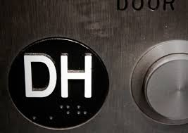
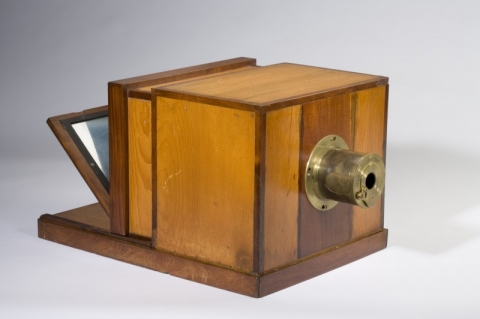

# IASC-2P02 | Minhal Enam

## Bio

My name is Minhal Enam. I was born and raised in Saudi Arabia. I am 22 years old. I am an Interactive Media student in Brock University. This is my second year. My area of research is cultural studies and photography, and my research program involves understanding the cultural status between the old and the newness of the object. This research focus is reflected in my projects with an example of daguerreotype which is the first imaging process in the history of photography and how the object carried a social movement in the 1800s. I will also be reviewing text visualization tool that I used in my collaborative project. Combining social and political context in digital humanity will help me to understand the infrastructure of everyday things in a clear manner. This portfolio will enable me to explore my inner interest towards cultural studies and digital humanity. However, this portfolio does demonstrate the areas of cultural studies through daguerreotypes which I will further explain in my featured project. Overall, I would like continue with this work in the future by looking at other objects related to media and photography and how using these objects are vital for our times.

## Featured Project [The Study of Daguerreotype]

In my featured project, I used “Daguerreotype” to demonstrate the work of media archeology. As I mentioned in my bio earlier that daguerreotype is the first imaging process in the history of photography. In my research presentation, I used the Pecha Kucha format to showcase my work. First of all, Daguerreotype was invented in 1839 by Louis-Jacques-Mandé Daguerre in France. Then, later the camera went public where people all over the world used it. I also explained how it worked through my research findings, starting with polishing a sheet of sliver to produce a mirror finish, treated it with fumes which made it light sensitive and then expose it in a camera for about 20 minutes or more based on the light it is receiving. Finally, it is taken out from the camera, treated it with mercury vapor, rinsed and dried, and then sealed into a protective frame glassware. Daguerreotypes are still used in niche markets by many photographers to get the unique feeling of the picture. Furthermore, I examined how daguerreotypes are compared to today’s digital photography and what element is still used from daguerreotypes, such as, the effects that are produced on the picture frame is now used as an effect on Photoshop and light room for editing purposes. I showed some vital daguerreotypes that were taken of Abraham Lincoln and the “First” solar eclipse in 1851. The significance of daguerreotypes are tremendous due to the impact it had from 1800s to now and how it evolved to a fast digital camera. It is important to study the cultural effects it had in that time.

This featured project evolved through different perspectives on daguerreotypes. I made all these changes which you can see [here] (https://github.com/me16jl/IASC-2P02/commit/0232e59b8a9b816b3876f98160c5e544cc536a42) I added five new points on top of my approach, firstly, its relationship towards people. People were amused and afraid at the same time during the release of the daguerreotype because of the unpredictable effects it contained. And how social status played a huge role on gaining attention from people to actually be interested in daguerreotypes. Secondly, I reviewed our relationship to technology with the example of daguerreotype, how we consider ourselves to be part of his techno-culture and how we immerse into technology. The daguerreotype was a worldwide phenomenon where the idea of imaging a moment was just beginning and studying the relationship it had between social elite and technology shows us our current emotions towards digital. Furthermore, I looked at the object’s failure, such as when object reaches its maturity and what happens then. The statement I made is that technology is constantly progressing to new needs. One of the vital point that I made is the effects of daguerreotypes on social stereotypes. The racial study of Native and South Americans led to humiliation of their own body. And how it created social image through daguerreotypes effected their professional life. Finally, I concluded with the parallel connection of modern day photography and daguerreotypes that “old media” plays an important role to uncover the failure and helps to make “new media” from the object’s failure. Through this featured project, I have learned the idea of media archeology and its importance to digital humanity. Daguerreotypes taught me the implications of technology in a society. 

+[click here](reveal)

## Collaborative Project

Project Description: In our collaborative project my team and I used Prism which is a text visualization tool. I helped the team to give an overview and explain the functions of the tool. Prism is used by students and teachers in school, universities, and other institutions to provide interpretation of texts. The main goal of the tool is to produce digital result compared to a traditional text and also provide with a clear visualization of the result. For our research findings, we used a song from System Of Down, “Chop Suey” and interpreted the song in three different types. We all voted to provide our insight to the song and found single and multiple meanings of the text.

Collaboration Statement: I approach collaboration in a simple way where division of responsibilities are distributed within the group members and each of us have to provide with an insight of the project. I started of the project with the introduction (available [here] (https://github.com/IascAtBrock/IASC-2P02-TeamPresentations/commit/87bcf7a4ac8bafc5d742090c9a6d2af1fae05832)) I also approached collaboration with the demo of the tool how it could be used in real world. Furthermore, collaboration enables us to critically analyze the team synergy within the group members and it helps to understand each other better to work better. Collaboration is important in any given situation to achieve a common academic goal. Here we understood the tool with our group effort and each of us contributed equally to further discover the deep understanding of the collaborative tool - Prism.  In terms of our workflow, we used powerpoint to review our project. Our main workflow approach was the github repository where we uploaded our own parts and gave us the assurance that all of us are on schedule by committing the changes. We also divided the 15 minute project time within 4 of us which gave us a clear goal to stay with the time frame. We started off with the intro, the research findings, the theoretical discussion and finally, the conclusion. With the idea of collaborative research in digital humanities, as cultural studies is my area of focus, this will let me explore other cultural perspectives from other scholars and work as a team to solve an issue. 

## Academic Blog

Ramsay's Reading +[continue reading](blog)

## Research Presentation

+[click here](reveal)

